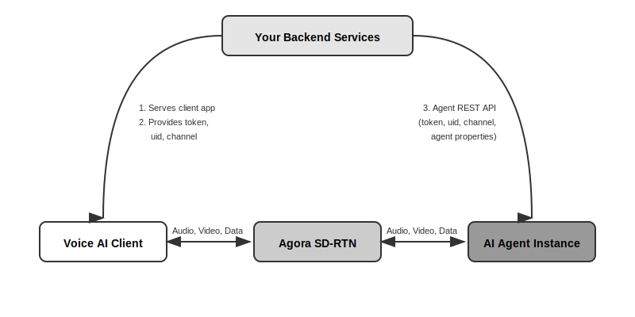

# Agora Conversational AI

A quick-start guide to understanding how the components connect

## System Architecture

## System Components

### Voice AI Client

Your front-end application (web, mobile, or desktop) that captures user inputs
and plays out the AI agent's responses. Built with the Agora RTC SDK and
optionally components from the Agora Conversational AI client-ui-kit used in the
samples.

### Your Backend Services

Your server-side application that authenticates users, generates Agora tokens,
and orchestrates the AI agent. It serves the client app and calls the Agora REST
API to start/stop agent instances.

### Agora SD-RTN

Agora's Software-Defined Real-Time Network. A global low-latency network that
routes audio, video, and data streams between participants in real-time.

### AI Agent Instance

A managed AI agent that joins the channel as a participant. It listens to user
audio, processes it through STT → LLM → TTS, and streams the response back.

## How It Works

**① User loads the client app** Your backend serves the Voice AI Client to the
user's device.

**② Client requests to join a session** Your backend generates a token, uid, and
channel name, then returns these credentials to the client.

**③ Backend starts the AI agent** Your backend calls the Agora Agent REST API
with the same token, uid, channel, plus any agent configuration (system prompt,
voice settings, etc.).

**④ Real-time conversation begins** Both the client and AI agent join the same
channel via SD-RTN. Audio, video, and data flow bidirectionally in real-time.

## Examples

Below are a series of examples which progress in complexity and cover both the
client and server components you will need.

---

### Vibe Coders

**Share this link with your AI and simply ask it for the client or backend you
desire.** → [View Quickstart Repository](./convo-ai-quickstart/)

---

**[Simple Voice AI Client](./simple-voice-client/)** Simple HTML/Javascript
client for connecting to an Agora RTC Channel with 2-way audio. Agora AI voice
agents can come and go. Useful for testing agents without needing to refresh or
reconnect client.

**[Simple Backend](./simple-backend/)** AWS Lambda (Python) function that
receives params via HTTPS, generates token, uid, and channel, then calls the
Agent REST API.

**[Complete Voice AI Client](./complete-voice-client/)** Complete
HTML/Javascript client that calls a backend to start an Agora AI voice agent and
get RTC credentials, then joins the channel to talk with the agent.

**[React JS Voice AI Client](./react-voice-client/)** React/Next.js
implementation using Agora AI UIKit components. Features TypeScript, shadcn/ui,
custom hooks, agent visualizer, and conversation history display with integrated
text chat.

**[Voice AI Client with Avatar & Video](./voice-client-avatar/)** Full-featured
client with AI avatar rendering and local video capture.

**[App Builder Client with Avatar & Video](./appbuilder-avatar/)** Built with
Agora App Builder for rapid prototyping with avatar and video capabilities.
